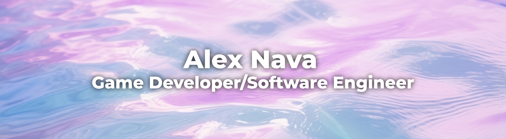

  
     
  

    
    
    
  

---

### :chart_with_upwards_trend: Stats

  
  

---

### :nerd_face: Bio
I'm a :video_game: &#8195;Game Developer/Software Engineer :computer: from Texas:cowboy_hat_face:. I'm currently developing an indie game with a friend of mine titled "Adventure Game". You can read more about it on the <a href="https://github.com/alexnava86/AdventureGame">GitHub repo</a>, or by visiting <a href="https://alexnava86.com/">my page</a>. For the time being, I work as a Graphic Design/Web Admin for a local printing company :printer: though I am seeking opportunities as a game or software developer.  

- :art::paintbrush: I'm also an artist. You can view some of my work <a href="https://alexnava86.com/Art/">here</a>.
- :guitar::musical_keyboard: I also like to play music, but I don't really write anything these days.
- :earth_americas::books: In my free time, I enjoy listening to history podcasts and watching historical documentaries.
- :jp::japanese_castle: 私も暇なときに日本語を勉強しま、でもまだあまり上手じゃありません。

---

### :hammer_and_wrench: Languages & Tools

  &nbsp;
  &nbsp;
  &nbsp;
  &nbsp;
  &nbsp;
  &nbsp;
  &nbsp;
  &nbsp;
  &nbsp;
  &nbsp;
  &nbsp;
  &nbsp;
  &nbsp;
  &nbsp;
  

---

### :mailbox: Contact Me
 
